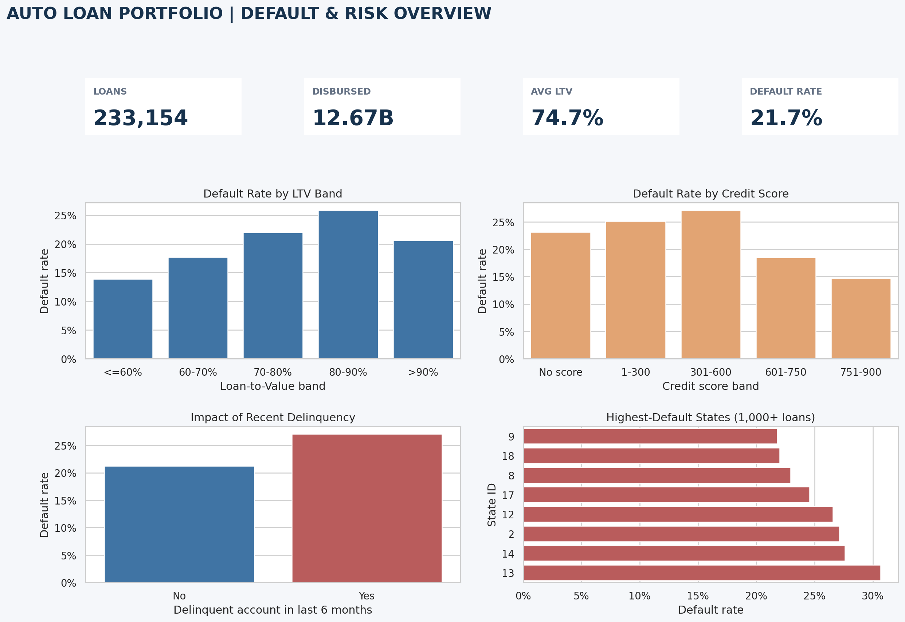

# Auto Loan Portfolio: Default & Risk Analysis

This project examines an auto-loan portfolio from a servicing and collections perspective. The goal is not to build a complex prediction model, but to identify portfolio segments that deserve closer monitoring and earlier collection treatment.



## Business questions

- What is the portfolio's overall default rate?
- Does default increase as loan-to-value (LTV) rises?
- How are credit history and recent delinquency associated with default?
- Which geographic segments combine meaningful volume with higher risk?
- Where could a collections team prioritize early intervention?

## Tools

- Python: data cleaning, segmentation and visualization
- SQL: portfolio KPIs and risk segmentation
- CSV: reproducible source and output tables
- Git/GitHub: documentation and version control

## Dataset

Source: [Vehicle Loan Default Prediction on Kaggle](https://www.kaggle.com/datasets/avikpaul4u/vehicle-loan-default-prediction)

Download the dataset manually and place `train.csv` inside `data/raw/`. The raw dataset is intentionally excluded from version control. No API or Kaggle token is required.

The dataset contains 233,154 vehicle loans and 41 fields, including disbursed amount, asset cost, LTV, employment type, credit bureau score, prior accounts, recent delinquency and loan default status.

## How to run

```bash
python -m venv .venv
source .venv/bin/activate  # Windows: .venv\Scripts\activate
pip install -r requirements.txt
python src/analyze.py
```

## Portfolio findings

- The portfolio contains **233,154 loans** with an overall default rate of **21.7%**.
- Default rises from **13.9%** below 60% LTV to **25.9%** in the 80-90% band. The small >90% segment breaks the pattern, so it should be monitored separately rather than used to claim a perfectly linear relationship.
- Customers with recent delinquent accounts default at **27.1%**, versus **21.3%** for customers without recent delinquency.
- Missing or limited bureau history is a meaningful operational segment rather than simply a data-quality issue.
- State-level monitoring should consider both default rate and account volume; small high-rate segments should not automatically receive the same priority as large exposed segments.

## Research paper

The project includes a short English-language paper structured in APA 7 format. It documents the objective, method, complete findings, operational interpretation, limitations and references.

- [APA 7 paper in Word](paper/auto_loan_portfolio_analysis_APA7.docx)
- [APA 7 paper in PDF](paper/auto_loan_portfolio_analysis_APA7.pdf)
- [Web-readable version](paper/auto_loan_portfolio_analysis_APA7.md)

## Business recommendations

1. Place high-LTV accounts with recent delinquency into an early-contact queue.
2. Separate customers with no bureau history into a dedicated monitoring segment.
3. Use state-level default rate together with portfolio volume when allocating collections capacity.
4. Track cure rate and roll rate in future iterations when monthly payment-history data becomes available.

## Repository structure

```text
auto-loan-default-analysis/
├── data/
│   ├── raw/                 # Local Kaggle file; not committed
│   └── processed/           # Aggregated portfolio outputs
├── reports/figures/         # Dashboard image
├── sql/                     # Business queries
├── src/                     # Reproducible Python analysis
├── requirements.txt
└── README.md
```

## Scope and limitations

`LOAN_DEFAULT` is a binary outcome. The dataset does not contain monthly payment history, days past due, collection attempts, cure rate, roll rate, repossession, charge-off or total-loss events. Therefore, this project discusses portfolio risk and prioritization without claiming to measure a complete collections operation.
